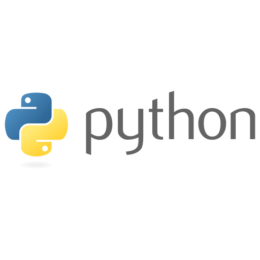
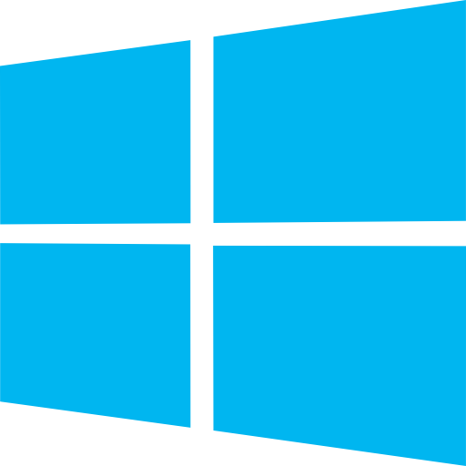
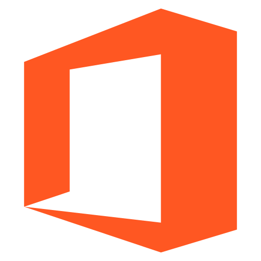

<h1 align="center"> 👨🏻‍💻  Hi there! <a href="https://www.linkedin.com/in/vcastilloc/"> My name is: Víctor José Castillo Castro </a> 👋</h1>

<h3 align="center"> A passionate Full Stack Developer from Cartagena (<em> Colombia </em>) </h3>
<h1 align="center"></h1>
<section align='left'>
  &nbsp;
  
<!--**VictorCast2/VictorCast2** is a ✨ _special_ ✨ repository because its `README.md` (this file) appears on your GitHub profile.-->

  
📝&nbsp;✨&nbsp; <strong>About me!</strong> 🔍&nbsp; 📚&nbsp; 

  
👨‍💻 I'm a highly competent systems technician with a passion for technology. My skills in handling various tools allow me to adapt quickly to new technologies and environments. 🛠️💪

📜 Ethical principles and confidentiality are at the core of my work. I hold a certificate in Professional Ethics, ensuring the highest standards of conduct. 🔒

🔐 With my Introduction to Cybersecurity certificate, I'm equipped to protect systems and data, ensuring their integrity and availability. 🛡️

💼 The Google certificate in Protecting Your Business in Telecommuting reflects my awareness of security challenges in remote work and my ability to implement suitable measures. 🏠✉️

💬 Effective communication is key, enabling me to collaborate seamlessly with colleagues and clients. I'm a creative problem-solver, always finding innovative solutions. 🗣️💡

👾 I am very curious and that is why you start studying programming. 🛠️

🗒 I am currently very obsessed with Full Stack. 🛠️

🤝 I thrive in teamwork and value collaboration. With dedication and a positive attitude, I achieve shared goals. 🚀

✨ In summary, my certifications and technical expertise make me a valuable and reliable professional. I'm committed to ethical practices, cybersecurity, and effective communication, driving success in the field of technology. 🌟

Keep pushing boundaries and embracing new challenges! 🚀💪 Embrace the power of teamwork, and together, we can achieve greatness! 🤝✨ Remember, every problem has a solution - let's find it! 💡🔧
                                                                                                                                                                                                                                     
                                                                                                                                                                                                                                     

 

### 🚀 👨‍💻 applications 👨‍💻 🚀
<section align='left'>
  

<a href="https://www.kali.org/">
  &nbsp;
</a>

<a href="https://www.linux.org/pages/download/">
  &nbsp;
</a>

<a href="https://support.apple.com/macos">
  &nbsp;
</a>

<a href="https://aprendejavascript.org/">
  &nbsp;
</a>

<a href="https://www.java.com/es/">
  &nbsp;
</a>

<a href="https://lenguajehtml.com/html/">
  &nbsp;
</a>

<a href="https://lenguajecss.com/css/introduccion/que-es-css/">
  &nbsp;
</a>

<a href="https://github.com/">
  &nbsp;
</a>

<a href="https://git-scm.com/">
  &nbsp;
</a>

<a href="https://www.microsoft.com/es-es/software-download/windows10">
  &nbsp;
</a>

<a href="https://www.office.com/?auth=2/">
  &nbsp;
</a>

<a href="https://www.canva.com.co/" target="_blank" rel="noreferrer">
  &nbsp; 
</a>

### ⚙️ &nbsp;GitHub Analytics

<!--Graph-->

<!--Skill And More Information--> 

<a href="https://github.com/VictorCast2">

  
  
  
  

</a>

## 📲&nbsp;💻&nbsp;🔗&nbsp; Connect with me 🔗&nbsp;🌐&nbsp;🤝&nbsp;

## 🔍&nbsp; Proyectos y Portafolios ✨&nbsp;📂&nbsp;
<table>
<tr>
<td width="50%">
<h3 align="center">Curso Android Básico</h3>

Aprende a programar aplicaciones <strong>Android con Kotlin desde cero</strong> - En este curso aprenderás todo lo necesario ya que no es necesario ningún conocimiento previo. Curso <strong>GRATUITO de 12 horas</strong> con todo el código disponible para descargar.

                                                                                      
</td>

<td width="50%">
                
<h3 align="center">Arquitectura MVVM</h3>

                                       

 

Las arquitecturas son <strong>IMPRESCINDIBLES</strong> para poder trabajar como desarrollador/a Android. En este curso, divido por ramas irás aprendiendo a implementar una arquitectura real y robusta con inyección de dependencias, clean architecture, testing y mucho más.

                                                             
</table>                                                                                 

 

## 🤝 &nbsp;Support me 🤝 &nbsp;

<!--**VictorCast2/VictorCast2** is a ✨ _special_ ✨ repository because its `README.md` (this file) appears on your GitHub profile.-->

If you enjoy my work and would like to support me, you can sponsor me on GitHub, YouTube, TikTok, Instagram, Twitter, and LinkedIn. 🙌🌟
Your support will enable me to focus more on open-source projects and contribute to the vibrant ecosystem. 🚀💻 
Your contributions will help me continue learning, growing, and making a positive impact. 📚🌱 
Together, we can create something amazing in the world of open-source! 💪.

  
 You can make a difference. ✨&nbsp; 

Your support can fuel my passion for coding and enable me to keep creating innovative solutions. Every line of code is a step towards a better future, and with your donation, we can build that future together. 🌍💪

My commitment to excellence and creativity in software development is unwavering. Every day, I dive into the world of code, seeking new ways to solve problems and make the digital world more efficient and accessible. 💻🚀 But to continue on this path, I need your help. 🙏

Your generosity can make a difference in my career as a developer. With every donation to my PayPal or Nequi account, you'll be investing in the future of technology and my personal growth. Every contribution, no matter the size, will become fuel to keep innovating and creating solutions that transform our reality. 🔥💡

Programming is my passion, but it's also my means to make the world a better place. With your support, I'll be able to access resources, tools, and courses that will allow me to hone my skills and stay at the forefront of the industry. 🌟📚

Join me on this journey and be part of the change. Your donation not only supports my professional growth but also contributes to projects and developments that can impact the lives of many. Together, we can drive technological advancements and open new opportunities for everyone. 🤝🌈

Make a difference today. Donate to my PayPal or Nequi account and help me continue creating code that changes the world. Your support is truly invaluable and appreciated! 🙌❤️

Thank you in advance for your generosity and for believing in my passion for programming. Together, we can achieve great things. 🚀🎉

